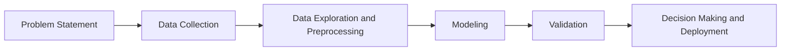

# Coursera - IBM Machine Learning Specialization

## Course 1: Exploratory Data Analysis for Machine Learning

### Week 1: A Brief History of Modern AI and its Applications

- [Practice Quiz: Artificial Intelligence and Machine Learning](course1/week1/quiz1.html)

#### Machine Learning Workflow

The machine learning workflow consists of following.
1. Problem Statement: Identify the problem
2. Data Collection: Gather the data to solve your problem
3. Data Exploration and Preprocessing: Analyze basic statistics and patterns of the data and prepare the data for machine learning
4. Modeling: Build a model based on the data
5. Validation: Test the model on new data
6. Decision Making and Deployment: Deploy the model to solve the problem.

The mermaid diagram below shows the workflow.

- [Practice Lab: Modern AI Applications and Workflows](course1/week1/quiz2.html)

- [Module 1: Modern AI and its Applications](course1/week1/module1.html)