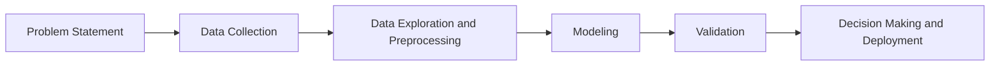

# Course 1: Exploratory Data Analysis for Machine Learning

## Week 1: A Brief History of Modern AI and its Applications

- [Practice Quiz: Artificial Intelligence and Machine Learning](week1/quiz1.html)

#### Machine Learning Workflow

The machine learning workflow consists of following.
1. Problem Statement: Identify the problem
2. Data Collection: Gather the data to solve your problem
3. Data Exploration and Preprocessing: Analyze basic statistics and patterns of the data and prepare the data for machine learning
4. Modeling: Build a model based on the data
5. Validation: Test the model on new data
6. Decision Making and Deployment: Deploy the model to solve the problem.

The mermaid diagram below shows the workflow.

- [Practice Lab: Modern AI Applications and Workflows](week1/quiz2.html)

- [Module 1 Quiz: Modern AI and its Applications](week1/module1.html)

## Week 2: Retrieving and Cleaning Data

You can use Pandas for reading and cleaning data. The lessons cover how to read CSV and JSON files using Pandas library.

- [Lab: Reading Data in Database Files - Part A](week2/01a_DEMO_Reading_Data.html)

- [Lab: Reading Data in Jupyter Notebook - Part B](week2/01b_LAB_Reading_Data.html)

- [Practice Quiz: Retrieving Data](week2/quiz1.html)

The model will not accept missing values and therefore we will have to handle missing data issues. There are multiple ways to handle missing values.
1. Drop the rows with missing data. This may lead to data loss for other features which had values.
2. Impute the missing data with some value. You can use mean, median to populate the missing features. This will mean you do not lose data for other features, but you will cause bias in your model because it's not the actual value of the feature.
3. Mask the missing data. This means create a category for missing data such as "missing". This means all missing values are treated the same way by the model.

An outlier is an observation in the data that is very distant from the most other observations.

- [Lab: Cleaning Data](week2/02_LAB_Data_Cleaning.html)

- [Practice Quiz: Cleaning Data](week2/quiz2.html)

- [Module 2 Quiz: Retrieving and Cleaning Data](week2/module2.html)